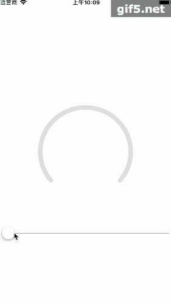
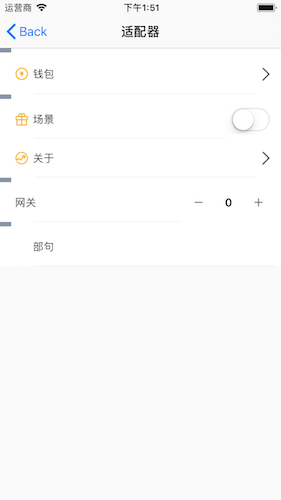

# HXLoopProgress

## num0：环形渐变进图条展示

+  温馨提示
这里一定要注意mask的使用，对于mask的定义如果不是很明白，可以看这里
mask中backgroudcolor的alpha比contents的图片alpha要强。
1：能看见底部 0 ： 不能看见底部   0-1 ：混合

1：backgroudcolor中alpha 为1 
+  则 不论contents中图片alpha是否透明，均可看见图层。

2：backgroudcolor中alpha 为0 
+  contents图片alpha 为 0 ：不能看见图层。
+  contents图片alpha 为 1 ：能看见图片中为1的图片轮廓下的图层。
+  contents图片alpha 为 0-1：能看到图片轮廓下图片和图层混合的图层。

3：backgroudcolor中alpha 为 0-1：
+  contents图片alpha 为 0 ：能看到蒙层的图层：全部
+  contents图片alpha 为 1 ：则看到图片轮廓是是实得，其余是虚的图像。
+  contents图片alpha 为 0-1：图片和图层混合的图层。

还有我的博客中写道
[https://blog.csdn.net/qq_27909209/article/details/81538170](https://blog.csdn.net/qq_27909209/article/details/81538170)

##
##  num1：适配器

